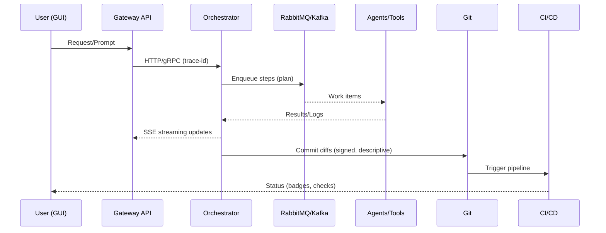

# Dataflow & Execution Model

```mermaid
sequenceDiagram
  participant U as User (GUI)
  participant GW as Gateway API
  participant OR as Orchestrator
  participant Q as RabbitMQ/Kafka
  participant AG as Agents/Tools
  participant G as Git
  participant CI as CI/CD

  U->>GW: Request/Prompt
  GW->>OR: HTTP/gRPC (trace-id)
  OR->>Q: Enqueue steps (plan)
  Q-->>AG: Work items
  AG-->>OR: Results/Logs
  OR-->>GW: SSE streaming updates
  OR->>G: Commit diffs (signed, descriptive)
  G->>CI: Trigger pipeline
  CI-->>U: Status (badges, checks)
```
