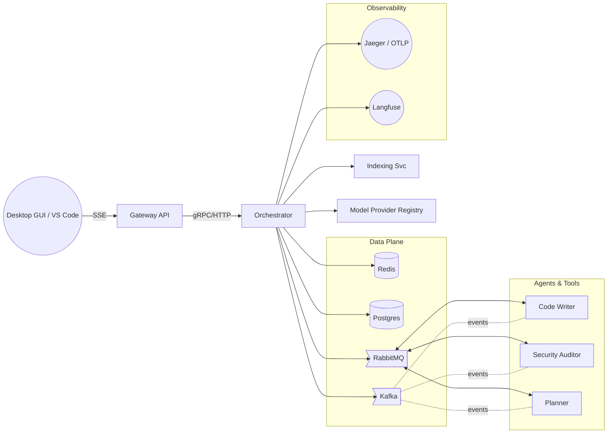

# Architecture Overview — OSS AI Agent Tool

The system combines a low-latency **inner loop** (gRPC/HTTP + SSE) with a durable **outer loop** (RabbitMQ or Kafka) to orchestrate multi-agent workflows for both **consumer** and **enterprise** deployments.

**Key properties**
- **SSE** for efficient UI streaming.
- **Hybrid context engine** (symbolic + semantic + temporal).
- **Multi‑bus**: RabbitMQ (tasks) alongside Kafka (event backbone / fan-out).
- **Stateful services**: Redis for low-latency cache/vector search; Postgres for durable history, audit, and Langfuse storage.
- **Multi‑provider** model routing (OpenAI, Anthropic, Gemini, Azure OpenAI, Bedrock, Mistral, OpenRouter, Local/Ollama).
- **Observability**: OpenTelemetry traces, Jaeger; structured logs; metrics dashboards.
- **Security**: least privilege, approvals, sandboxing, egress allow-lists, signed images and SBOMs.
